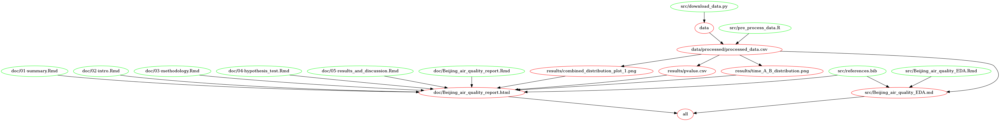

# Beijing Air Quality Analysis

**Authors:** Jacqueline Chong, Junrong Zhu, Macy Chan, Vadim Taskaev

Data analysis project for DSCI 522 (Data Science Workflows); a course in the Master of Data Science program at the University of British Columbia.

Milestone3 Link: <https://github.com/UBC-MDS/beijing_air_quality_analysis/tree/c05cf571eb5ebbd61355599a814123c56642776b>

## Introduction

Beijing, China has long struggled with poor air quality, a result of the country's rapid industrialization and its heavy reliance on coal for electricity generation, as well as its growing and increasingly urban middle class (Wang and Hao 2012). In September 2021, the World Health Organization revised its air quality guidelines to more restrictive levels following the increasingly evident causal relationships between poor air quality and its harmful health consequences on impacted mainly urban communities (WHO 2021).

In this project, we will analyse the `Beijing Air Quality` data set, donated to the UC Irvine Machine Learning Repository in 2019 (accessible via [URL](https://archive-beta.ics.uci.edu/ml/datasets/beijing+multi+site+air+quality+data)), which comprises hourly measurement of six air pollutants (including `PM2.5`, `PM10`, `SO2`, `NO2`, `CO`, `O3`) and six meteorological variables spanning from 2013 until 2017 across twelve of its metropolitan data-collecting stations. We are interested in finding possible improvements in `PM2.5` metric, a form of fine particulate matter that is considered especially harmful for its ability to penetrate deep into the lungs and cause long-lasting damage to the respiratory system (Xing et al. 2016), in Beijing from 2013 to 2017. We acknowledge that we are only studying Beijing's air quality, and thus our results cannot be generalized to the whole China.

In general, the objective of this project is to answer the following inferential question: **Do PM2.5 measurements in Beijing, China collected from 2013 to 2017 show any sign of improvement?**

## About

Firstly, we performed initial EDA to study the data structure, detect missing values/outliers, and visualize the `PM2.5` measurements distribution to find a suitable test and estimator for our inferential question. The report for our exploratory data analysis can be found [here](https://github.com/UBC-MDS/DSCI_522_Beijing_Air_Quality/blob/main/src/Beijing_air_quality_EDA.md).

During EDA, we wrangled the original data set and preprocessed the data into two samples based on the time periods, referred as `time_A` (2013-2015) and `time_B` (2015 - 2017) for hypothesis testing purpose. Since we considered observing drastic changes in PM2.5 measurements per year unrealistic, we chose to proceed with a comparison of two longer time intervals for the hypothesis tests. Given that we have good sample size for both time periods and the data points are independent, applying a hypothesis test for independence is feasible for this project. Hence, we performed a hypothesis test to determine whether there is statistical evidence to indicate an improvement in PM2.5 measurements in Beijing between 2013 and year 2017. We implemented one-tailed test to answer the question since we are more interested to detect an improvement in PM2.5 pollution.

-   Null Hypothesis (*H*0): The median PM2.5 value in Beijing in time_A is less than or equal to the median PM2.5 value in time_B (*Q*\_*A*(0.5) ≤ *Q*\_*B*(0.5))

-   Alternative Hypothesis (*H**A*): There median PM2.5 value in Beijing in time_A is greater than the median PM2.5 values in time_B (*Q*\_*A*(0.5) > *Q*\_*B*(0.5))

## Structure Diagram (analysis process)

Figure 1. Files graph (\**click on it to view the enlarged file graph diagram)*

## Report

The final report can be found in this [webpage](https://ubc-mds.github.io/beijing_air_quality_analysis/)

## Usage

There are two suggested ways to run this analysis:

#### **1. Using Docker**

To replicate the analysis, install [Docker](https://www.docker.com/get-started). Make sure you have configured Docker to allow at least 7 GB memory to run. Then clone this GitHub repository and run the following command at the command line/terminal from the root directory of this project:

    docker run --rm --platform linux/amd64 -v "$(PWD):/home/beijing_air_quality" jacqann/beijing-air-quality@sha256:4b8e3a93539d8cde4ec72178ffd826d8e37dd26037722d4eae3da6752f6a0fdf make -C /home/beijing_air_quality all

Two reports can be found,

> 1.  `src\Beijing_air_quality_EDA.Rmd` : A detailed EDA report for Beijing air quality analysis and visualization
> 2.  `doc\Beijing_air_quality_report.html` : Equivalent to final report [webpage](https://ubc-mds.github.io/beijing_air_quality_analysis/)

To reset the repo to a clean state, with no intermediate or results files, run the following command at the command line/terminal from the root directory of this project:

    docker run --rm --platform linux/amd64 -v "$(PWD):/home/beijing_air_quality" jacqann/beijing-air-quality@sha256:4b8e3a93539d8cde4ec72178ffd826d8e37dd26037722d4eae3da6752f6a0fdf make -C /home/beijing_air_quality clean
    
#### **2. Without using Docker**

To replicate the analysis, clone this GitHub repository, install the dependencies listed below, and run the following command at the command line/terminal from the root directory of this project:

    make all

To reset the repo to a clean state, with no intermediate or results files, run the following command at the command line/terminal from the root directory of this project:

    make clean

## Dependencies

-   Python 3.7.3 and Python packages:

    -   docopt==0.6.2
    -   requests==2.22.0
    -   pandas==0.24.2
    -   urllib.request==3.9

-   R version 3.6.1 and R packages:

    -   knitr==1.36
    -   tidyverse==1.3.1
    -   ggthemes==4.2.4
    -   here==1.0.1
    -   cowplot==1.1.1
    -   scales==1.1.1
    -   forcats==0.5.1
    -   stringr==1.4.0
    -   dplyr==1.0.7
    -   purrr==0.3.4
    -   readr==2.0.2
    -   tidyr==1.1.3
    -   tibble==3.1.5
    -   ggplot2==3.3.5
    -   infer==1.0.0
    -   caret==4.1.0

## License

This dataset is licensed under a [Creative Commons Attribution 4.0 International](https://creativecommons.org/licenses/by/4.0/legalcode) (CC BY 4.0) license.

This allows for the sharing and adaptation of the datasets for any purpose, provided that the appropriate credit is given.

# References

Wang, Shuxiao, and Jiming Hao. 2012. "Air Quality Management in China: Issues, Challenges, and Options." Journal of Environmental Sciences 24 (1): 2--13.

WHO. 2021. "WHO Global Air Quality Guidelines: Particulate Matter (Pm2. 5 and Pm10), Ozone, Nitrogen Dioxide, Sulfur Dioxide and Carbon Monoxide: Executive Summary."

Xing, Yu-Fei, Yue-Hua Xu, Min-Hua Shi, and Yi-Xin Lian. 2016. "The Impact of Pm2. 5 on the Human Respiratory System." Journal of Thoracic Disease 8 (1): E69.
