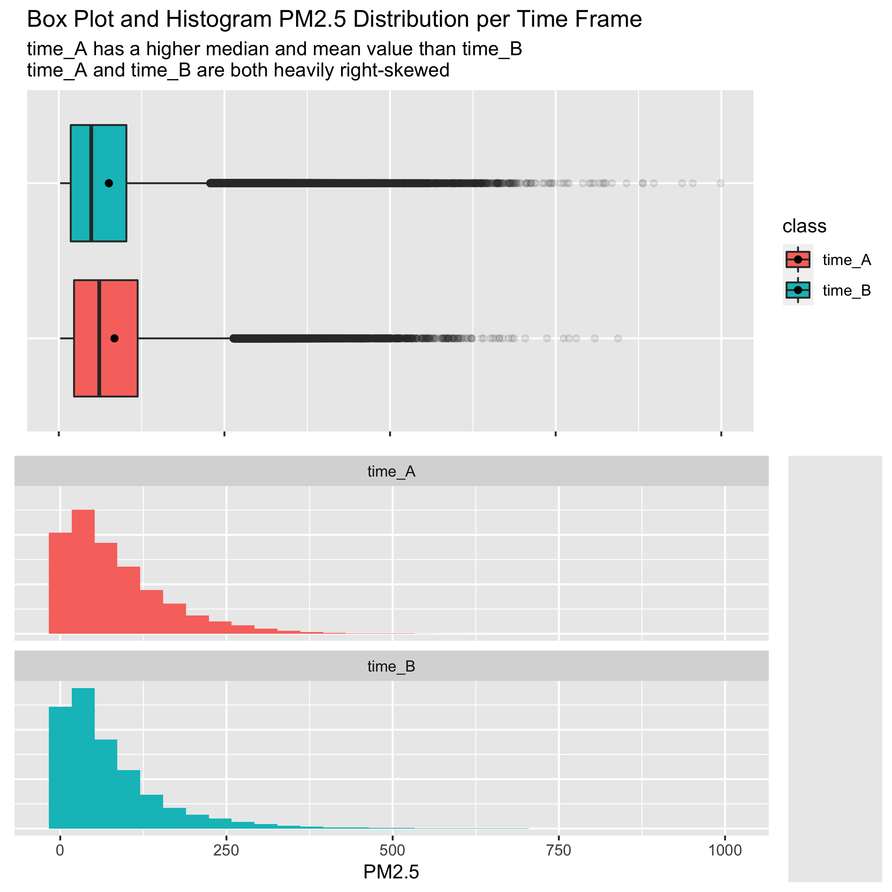

## Methodology
\label{sec:methods}
```{r echo=FALSE, include=FALSE}
library(here)
library(knitr)
```


We combine the data from twelve data collection stations across Beijing into one data frame and split them into the following two time frames:

-   `time_A`: PM2.5 measurements from March 2013 until February 2015 (inclusive)

-   `time_B`: PM2.5 measurements from March 2015 until February 2017 (inclusive)

Through Exploratory Data Analysis, we identify that our data is heavily skewed and more suitable to analyze the median.

```{r eda plot for report, echo=FALSE, fig.cap="Figure 2. Both time_A and time_B distributions are right-skewed", out.width = '80%'}

```

Figure 2. Both time_A and time_B distributions are right-skewed

We answer the main question of this project using the following methodology pipeline. Based on the theoretical assumption that data points across both samples are independent and identically distributed (i.i.d.) when their hourly collected data are distributed over multi-year time span, we performed a hypothesis test to determine whether there is statistical evidence to indicate an improvement in PM2.5 measurements in Beijing between 2013 and 2017. To do so, we implement a one-tailed hypothesis test to answer to compare these measurements between two equal-interval time intervals (`time_A` and `time_B`).
