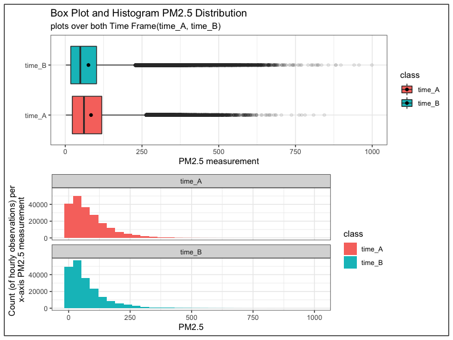

Exploratory data analysis of Beijing air quality data set
================
Jacqueline Chong, Junrong Zhu, Macy Chan, Vadim Taskaev

-   [Data Import](#data-import)
-   [Study the data](#study-the-data)
-   [Data Wrangling](#data-wrangling)
-   [Distribution of data points for each
    class](#distribution-of-data-points-for-each-class)
-   [Distribution of PM2.5 levels across time_A and
    time_B](#distribution-of-pm25-levels-across-time_a-and-time_b)

## Data Import

The data is downloaded and unzipped by a [python
script](https://github.com/UBC-MDS/DSCI_522_Beijing_Air_Quality/blob/main/src/download_data.py).
12 csv files were used in this project. Each file represents one of 12
nationally-controlled air-quality monitoring sites, which captured
information **between March 2013 and February 2017**. They are all in
the same format (.csv files), and are merged and stored in `air_data`.

|  No | year | month | day | hour | PM2.5 | PM10 | SO2 | NO2 |  CO |  O3 | TEMP |   PRES |  DEWP | RAIN | wd  | WSPM | station      |
|----:|-----:|------:|----:|-----:|------:|-----:|----:|----:|----:|----:|-----:|-------:|------:|-----:|:----|-----:|:-------------|
|   1 | 2013 |     3 |   1 |    0 |     4 |    4 |   4 |   7 | 300 |  77 | -0.7 | 1023.0 | -18.8 |    0 | NNW |  4.4 | Aotizhongxin |
|   2 | 2013 |     3 |   1 |    1 |     8 |    8 |   4 |   7 | 300 |  77 | -1.1 | 1023.2 | -18.2 |    0 | N   |  4.7 | Aotizhongxin |
|   3 | 2013 |     3 |   1 |    2 |     7 |    7 |   5 |  10 | 300 |  73 | -1.1 | 1023.5 | -18.2 |    0 | NNW |  5.6 | Aotizhongxin |
|   4 | 2013 |     3 |   1 |    3 |     6 |    6 |  11 |  11 | 300 |  72 | -1.4 | 1024.5 | -19.4 |    0 | NW  |  3.1 | Aotizhongxin |
|   5 | 2013 |     3 |   1 |    4 |     3 |    3 |  12 |  12 | 300 |  72 | -2.0 | 1025.2 | -19.5 |    0 | N   |  2.0 | Aotizhongxin |
|   6 | 2013 |     3 |   1 |    5 |     5 |    5 |  18 |  18 | 400 |  66 | -2.2 | 1025.6 | -19.6 |    0 | N   |  3.7 | Aotizhongxin |

Table 1. Preview of original datset

## Study the data

This data set contains hourly air pollutants data from 12
nationally-controlled air-quality monitoring sites in Beijing, China
from **1 March 2013 to 28 February 2017**. The air-quality data is
retrieved from the Beijing Municipal Environmental Monitoring Center. It
was sourced from the UCI Machine Learning Repository
[here](https://archive-beta.ics.uci.edu/ml/datasets/beijing+multi+site+air+quality+data).

This is the structure of each features in the data set.

    ## spec_tbl_df [420,768 × 18] (S3: spec_tbl_df/tbl_df/tbl/data.frame)
    ##  $ No     : num [1:420768] 1 2 3 4 5 6 7 8 9 10 ...
    ##  $ year   : num [1:420768] 2013 2013 2013 2013 2013 ...
    ##  $ month  : num [1:420768] 3 3 3 3 3 3 3 3 3 3 ...
    ##  $ day    : num [1:420768] 1 1 1 1 1 1 1 1 1 1 ...
    ##  $ hour   : num [1:420768] 0 1 2 3 4 5 6 7 8 9 ...
    ##  $ PM2.5  : num [1:420768] 4 8 7 6 3 5 3 3 3 3 ...
    ##  $ PM10   : num [1:420768] 4 8 7 6 3 5 3 6 6 8 ...
    ##  $ SO2    : num [1:420768] 4 4 5 11 12 18 18 19 16 12 ...
    ##  $ NO2    : num [1:420768] 7 7 10 11 12 18 32 41 43 28 ...
    ##  $ CO     : num [1:420768] 300 300 300 300 300 400 500 500 500 400 ...
    ##  $ O3     : num [1:420768] 77 77 73 72 72 66 50 43 45 59 ...
    ##  $ TEMP   : num [1:420768] -0.7 -1.1 -1.1 -1.4 -2 -2.2 -2.6 -1.6 0.1 1.2 ...
    ##  $ PRES   : num [1:420768] 1023 1023 1024 1024 1025 ...
    ##  $ DEWP   : num [1:420768] -18.8 -18.2 -18.2 -19.4 -19.5 -19.6 -19.1 -19.1 -19.2 -19.3 ...
    ##  $ RAIN   : num [1:420768] 0 0 0 0 0 0 0 0 0 0 ...
    ##  $ wd     : chr [1:420768] "NNW" "N" "NNW" "NW" ...
    ##  $ WSPM   : num [1:420768] 4.4 4.7 5.6 3.1 2 3.7 2.5 3.8 4.1 2.6 ...
    ##  $ station: chr [1:420768] "Aotizhongxin" "Aotizhongxin" "Aotizhongxin" "Aotizhongxin" ...

Table 2: Structure of our data set `air_data`

Each row in the data set represents a measurement of air pollutants
(e.g., PM2.5, PM10, CO) at specific year, month, and day in 12 different
district in Beijing, including Aotizhongxin, Changping, Dingling. The
meteorological data in each air-quality site are matched with the
nearest weather station from the China Meteorological Administration.
There are `420,768` observations and `18` features in the data set.

Below we show the description and missing value of each features in the
data set.

|         | Description                             | # of missing values |
|:--------|:----------------------------------------|--------------------:|
| No      | Row number                              |                   0 |
| year    | Year of data in this row                |                   0 |
| month   | Month of data in this row               |                   0 |
| day     | Day of data in this row                 |                   0 |
| hour    | Hour of data in this row                |                   0 |
| PM2.5   | PM2.5 concentration (ug/m^3)            |                8739 |
| PM10    | PM10 concentration (ug/m^3)             |                6449 |
| SO2     | SO2 concentration (ug/m^3)              |                9021 |
| NO2     | NO2 concentration (ug/m^3)              |               12116 |
| CO      | CO concentration (ug/m^3)               |               20701 |
| O3      | O3 concentration (ug/m^3)               |               13277 |
| TEMP    | Temperature (degree Celsius)            |                 398 |
| PRES    | Pressure (hPa)                          |                 393 |
| DEWP    | Dew point temperature (degree Celsius)  |                 403 |
| RAIN    | Precipitation (mm)                      |                 390 |
| wd      | Wind direction                          |                1822 |
| WSPM    | Wind speed (m/s)                        |                 318 |
| station | Name of the air-quality monitoring site |                   0 |

Table 3. Description and instances of missing values in the original
dataset

As we are interested to determine how PM2.5 levels have changed over two
time periods - between **March 1 2013 to Feb 28 2015**, and **March 1
2015 to Feb 28 2017**, we would first like to see if there are any micro
changes associated with how these levels shift across years and months.
Here we are going to create two summary tables on yearly and monthly
PM2.5 values.

|      | 2013 | 2014 | 2015 | 2016 | 2017 |
|:-----|-----:|-----:|-----:|-----:|-----:|
| mean |   80 |   86 |   80 |   72 |   93 |
| min  |    2 |    3 |    3 |    3 |    2 |
| max  |  844 |  809 |  762 |  999 |  835 |

Table 4. Mean, max and min of PM2.5 per year

Looking at the statistic values on **Table 4**, 2016 had the largest
range of PM2.5 levels (from 72(ug/m^3) to 999(ug/m^3)), while 2015 had
the lowest `pm_max` value but its mean was the same as in 2013.

<!-- -->

Figure 1. Yearly Summary Line Plot of PM2.5 Measurements, illustrating
the evolution of PM2.5 mean PM2.5 measurements (in green) as well as
minimum and maximum PM2.5 measurements (in blue and red) between 2013
and 2017 (inclusive). This figure demonstrates the relatively modest
mean measurement in relation to maximum values observed, and the
relatively larger variability of maximum measurement observations.

As seen from **Figure 1** above, the variation in the **max** PM2.5
measurements across the years is the most obvious comparing to the
changes in the overall `pm_min` and `pm_mean` values.

|      |   1 |   2 |   3 |   4 |   5 |   6 |   7 |   8 |   9 |  10 |  11 |  12 |
|:-----|----:|----:|----:|----:|----:|----:|----:|----:|----:|----:|----:|----:|
| mean |  94 |  88 |  95 |  73 |  63 |  69 |  72 |  53 |  61 |  92 |  93 | 105 |
| min  |   2 |   3 |   3 |   2 |   3 |   2 |   3 |   3 |   3 |   3 |   3 |   3 |
| max  | 835 | 999 | 558 | 533 | 844 | 560 | 540 | 500 | 477 | 527 | 687 | 741 |

Table 5. Mean, max and min of PM2.5 per month

<!-- -->

Figure 2. Monthly Summary Line Plot of PM2.5 Measurements

As seen from Figure 2, `pm_mean` is generally at the lowest in August
and September and overall the variation in max surpasses the changes in
mean and min values.

In general, we can not conclude significant differences among these
statistical summary values to answer the main question: **Do PM2.5
measurements in Beijing, China collected from 2013 to 2017 show any sign
of improvement?**. As such, we will perform further data wrangling and
exploration to find out more representative characteristics of our data.

## Data Wrangling

Since we observe only slight changes in yealy PM2.5 measurements, we
have chosen to focus our analysis on determining how PM2.5 measurements
have changed between two time periods - between **March 1 2013 to Feb 28
2015**, and **March 1 2015 to Feb 28 2017**. Hereafter in this project,
we will refer to first time period **March 1 2013 to Feb 28 2015** as
`time_A` and second time period **March 1 2015 to Feb 28 2017** as
`time_B` in both visualization and code scripts after we processed the
raw data.

We set out to answer these questions from our proposal:

1.  How does the distribution of air quality data observations look
    like? Are they normally distributed?
2.  If we split the data into sub data sets based on time frames, will
    there be any overlap in the ranges of the samples?

Before we answer these sub-EDA questions, we dropped all irrelevant
columns, and only kept **year**, **month**, **PM2.5**. Since we observed
that there are `8739 missing values` in the combined raw data from
**Table 3** (Description and instances of missing values), we will drop
all the missing PM2.5 value rows. Furthermore, we are going to create a
derived column `class`, which contains our explanatory variables
`time_A` and `time_B`.

    ## # A tibble: 412,029 × 4
    ##     year month PM2.5 class 
    ##    <dbl> <dbl> <dbl> <chr> 
    ##  1  2013     3     4 time_A
    ##  2  2013     3     8 time_A
    ##  3  2013     3     7 time_A
    ##  4  2013     3     6 time_A
    ##  5  2013     3     3 time_A
    ##  6  2013     3     5 time_A
    ##  7  2013     3     3 time_A
    ##  8  2013     3     3 time_A
    ##  9  2013     3     3 time_A
    ## 10  2013     3     3 time_A
    ## # … with 412,019 more rows

Table 6: Preview of the `air_data_processed` data frame.

## Distribution of data points for each class

| Class  | Sum.of.rows |
|:-------|------------:|
| time_A |      205989 |
| time_B |      206040 |

Table 7. Sum of rows in each class.

Both classes are equally distributed, even after dropping the missing
PM2.5 values present in our data set. As such, we are not concern about
class imbalance which could lead to statistical parity.

## Distribution of PM2.5 levels across time_A and time_B

Having verified that both classes are balanced, we move on to observe
the distribution between both `time_A` and `time_B`.

<!-- -->

Figure 3. Boxplot and Histogram for both samples’ PM2.5 distribution.
(Black dots represent the mean PM2.5 value of each sample)

The scale in the x-axis is identical for both plots. Both samples are
heavily right skewed, as seen from numerous right-sided outliers in the
boxplot and the long right tail in the histograms. `time_A` has a higher
median and mean PM2.5 value than `time_B`, and its data distribution is
wider than B. It is fair to conclude that the **median and mean values
are too similar to make a definitive statement as to whether the air
quality has changed over these two time frames**.

As our distribution is heavily skewed to the right, the mean is getting
drawn to the right side. As such, we will **take median as the
appropriate estimator for hypothesis testing**, since it is not
sensitive to extreme values since we are taking the 50th percentile of
our data.

To explore further, we are plotting a log density graph to see how the
PM2.5 levels are distributed.

<!-- -->

Figure 4. Density Plot for time_A and time_B

Looking at these areas:  
**(1) on the left of the orange vertical line**  
**(2)** **the right of the purple vertical line,**

it is clear that the area under the curve for `time_A` in these two
sections are larger than the area under the curve of `time_B`. This
indicates `time_A` has more extreme values than `time_B`. The area under
the curve of `time_B` dominates between the orange line and purple
vertical line (it completely covered the area of `time_A`). However,
there are overlapping areas. The distinct areas of `time_A` and `time_B`
in this density plot suggests that `time_A` could possibly have a higher
median than `time_B`.
